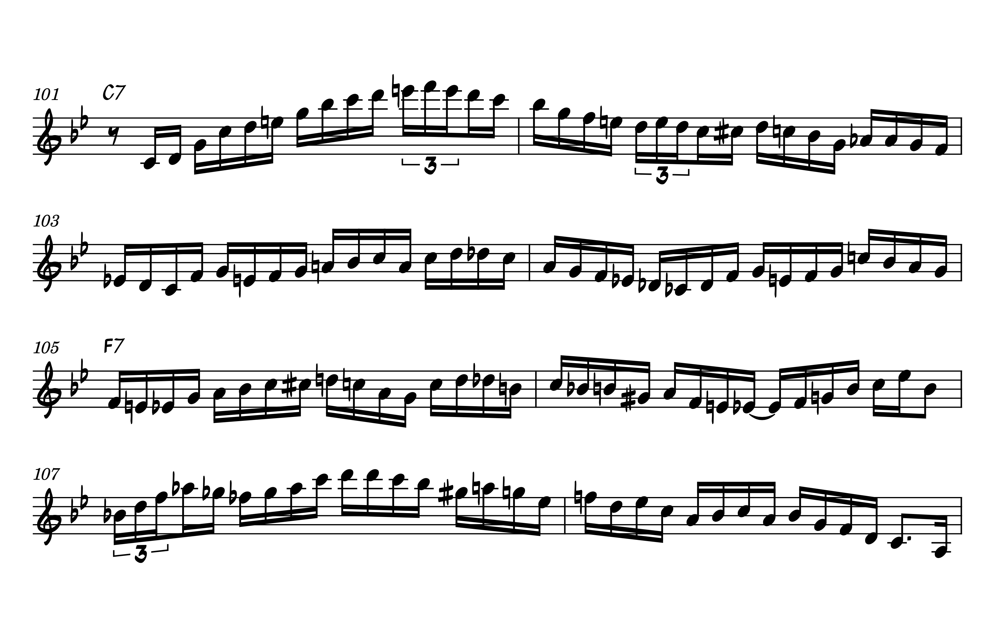

 
<iframe class="video" width="560" height="315" src="https://www.youtube.com/embed/el9Um6T8ZKA" title="YouTube video player" frameborder="0" allow="accelerometer; autoplay; clipboard-write; encrypted-media; gyroscope; picture-in-picture" allowfullscreen></iframe>
 

I originally transcribed this solo back in 2017 but was never really happy with the final result. The playing is just *so fast* that even after slowing the recording down to 10% speed in Audacity it was still hard to make out exactly what was going on. With technology failing me once again, I had to take a more *vibes-based* approach. Using the chord changes and the general melodic shape, I think I&rsquo;ve landed on something that&rsquo;s serviceable, although probably not 100% accurate. Without a video of Wynton&rsquo;s fingers from the night this was recorded, there will always be a little bit of doubt.

Compare this section from the original recording at full speed

<audio controls="controls">
    <source type="audio/mp3" src="fast-section-original-full-speed.mp3">
</audio>
 

to a virtual playback of the transcription.
 
 
<audio controls="controls">
    <source type="audio/mp3" src="fast-section-midi-playback-full-speed.mp3">
</audio>

It sounds&hellip; close. Definitely in terms of melodic contour I&rsquo;m satisfied; and once the shape is correct, filling in the notes can be done somewhat automatically by looking at the chords and making an educated guess about what would make sense to go over them. Slowing it down, though, reveals some additional wrinkles. Here&rsquo;s the original recording again at half-speed
 
 
<audio controls="controls">
    <source type="audio/mp3" src="fast-section-original-half-speed.mp3">
</audio>

and for completeness, here&rsquo;s my transcription at half-speed.
 
 
<audio controls="controls">
    <source type="audio/mp3" src="fast-section-midi-playback-half-speed.mp3">
</audio>

In my attempt to notate and &ldquo;square off&rdquo; the rougher edges of the recording, I *do* think that there are some n   otes that get lost in the mix. But we&rsquo;re talking about hundredths of a second here, and in the broader context of making this transcription a useful learning tool I think there&rsquo;s a balance to be struck between absolute accuracy and readability.

A PDF of the transcription is available for download [here](bright-mississippi-wynton-marsalis-transcription.pdf).
